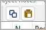

# nv_clipboard

The [novelibre](https://github.com/peter88213/novelibre/) Python program helps authors organize novels.  

*nv_clipboard* is a plugin providing copy and paste capability for *novelibre* tree elements. 

## Features

You can copy and paste the following tree elements via the system clipboard:

- Parts and chapters,
- sections,
- stages, 
- plot lines,
- plot points,
- characters, 
- locations, 
- items, 
- project notes.

Elements can be transferred to and from the clipboard one by one. 
The element's properties and children are copied, except relationships. 

Via the clipboard, you can transfer these elements between different *novelibre*
projects, or within a project. 

## Requirements

- [novelibre](https://github.com/peter88213/novelibre/) version 4.11+

## Download and install

### Default: Executable Python zip archive

Download the latest release [nv_clipboard_v1.2.1.pyzw](https://github.com/peter88213/nv_clipboard/raw/main/dist/nv_clipboard_v1.2.1.pyzw)

- Launch *nv_clipboard_v1.2.1.pyzw* by double-clicking (Windows/Linux desktop),
- or execute `python nv_clipboard_v1.2.1.pyzw` (Windows), resp. `python3 nv_clipboard_v1.2.1.pyzw` (Linux) on the command line.

#### Important

Many web browsers recognize the download as an executable file and offer to open it immediately. 
This starts the installation.

However, depending on your security settings, your browser may 
initially  refuse  to download the executable file. 
In this case, your confirmation or an additional action is required. 
If this is not possible, you have the option of downloading 
the zip file. 

### Alternative: Zip file

The package is also available in zip format: [nv_clipboard_v1.2.1.zip](https://github.com/peter88213/nv_clipboard/raw/main/dist/nv_clipboard_v1.2.1.zip)

- Extract the *nv_clipboard_v1.2.1* folder from the downloaded zipfile "nv_clipboard_v1.2.1.zip".
- Move into this new folder and launch *setup.pyw* by double-clicking (Windows/Linux desktop), 
- or execute `python setup.pyw` (Windows), resp. `python3 setup.pyw` (Linux) on the command line.

---

[Changelog](docs/changelog.md)

## Usage

See the [online manual](https://peter88213.github.io/nvhelp-en/nv_clipboard/)

---

## Credits

- The toolbar icons are based on the [Eva Icons](https://akveo.github.io/eva-icons/#/), published under the [MIT License](http://www.opensource.org/licenses/mit-license.php). The original black and white icons were colored for this plugin by the maintainer. 

## License

This is Open Source software, and the *nv_clipboard* plugin is licensed under GPLv3. See the
[GNU General Public License website](https://www.gnu.org/licenses/gpl-3.0.en.html) for more
details, or consult the [LICENSE](https://github.com/peter88213/nv_clipboard/blob/main/LICENSE) file.
